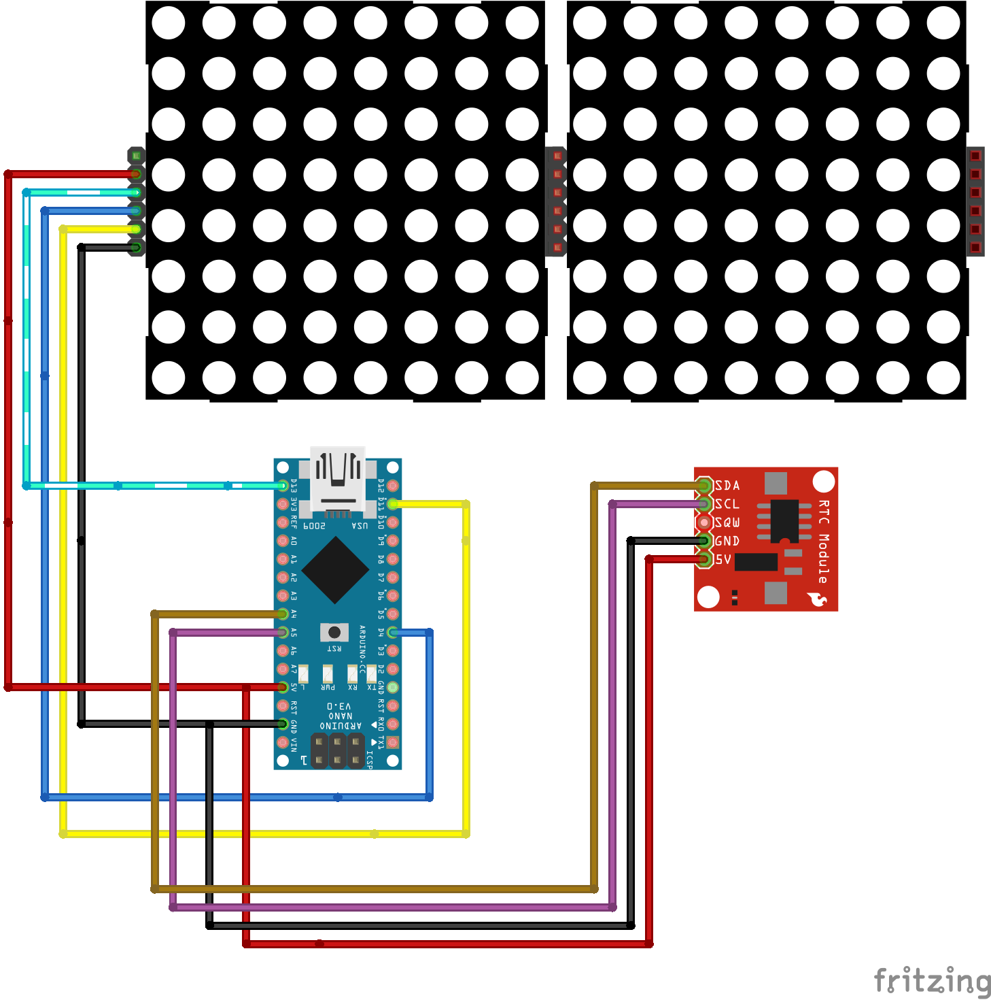
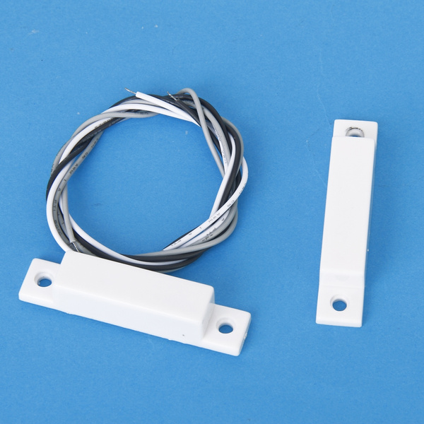
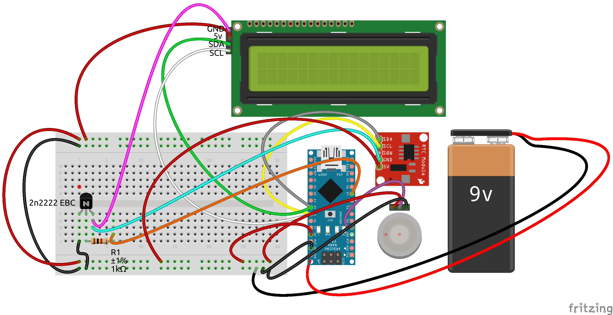
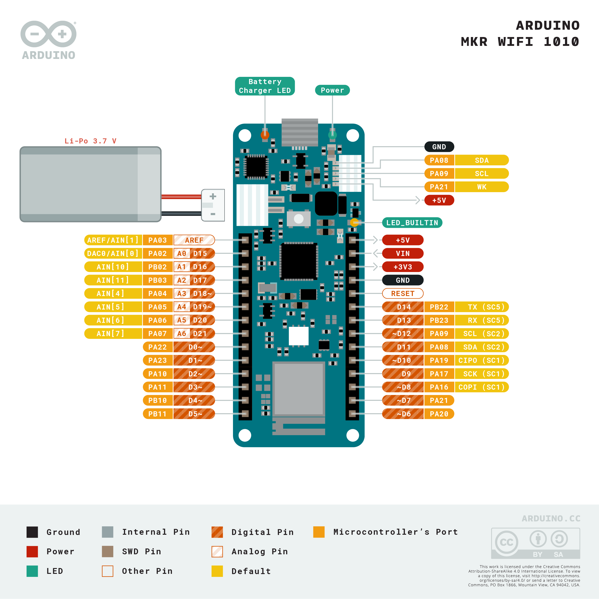

# Indice 

Arduino utilizza il linguaggio `C++` ma esporta una serie di funzioni molto semplici per il controllo dell'Hardware.
[Qui](https://www.arduino.cc/reference/it/) puoi trovare la documentazione ufficiale del linguaggio di Arduino.


Qua sotto riporto comunque qualche costrutto fondamentale del linguaggio `C++` e qualche funzione esportata da Arduino.

**Le variabili**

| Tipo di Dato | Dimensione  | Descrizione  |
| -----------  | ----------- | ----------- |
| char         | 1 Byte         | Contenitore per caratteri e valori alfanumerici (e.g., ‘a’, ‘b’, ‘1’, etc)      |
| bool   | 1 Byte        |Contenitore per valori booleani (e.g., true, false)
| int   | 2 Byte        |Contenitore per numeri interi nel range numerico, da -32768 a 32767.
| unsigned int  | 2 Byte        |Contenitore per numeri interi senza segno nel range numerico, da 0 a 65535.
| long  | 4 Byte        |Contenitore per numeri interi nel range numerico, da -2147483648 a 2147483647
| unsigned long  | 4 Byte        |Contenitore per numeri interi nel range numerico, da 0 to 4,294,967,295 (2^32 – 1)
| float  | 4 Byte        |Contenitore per numeri interi nel range numerico, da 0 to 4,294,967,295 (2^32 – 1)
| double  | 4 Byte        |Contenitore per numeri interi nel range numerico, da 0 to 4,294,967,295 (2^32 – 1)
| String  | -       |Contenitore per testo (e.g., “Resistenza”)


## Binary Clock

Per questo orologio binario ho utilizzato la libreria [simple_matrix](https://github.com/Electro707/Simple-LED-Matrix-Library) per la gestione della matrice di LED e la libreria [RTClib](https://github.com/adafruit/RTClib) per la gestione del tempo.

Ho modificato la libreria [simple_matrix](https://github.com/Electro707/Simple-LED-Matrix-Library) creando una nuova versione, [simple_matrix_v2](https://github.com/CodeCoagious19/arduino-libraries/tree/master/MatrixLEDLib_v2) che in più contiene i metodi:

- `writeSquare(order, x, y, value)`
- `writePixel(x, y, value)`

### Collegamenti Hardware

|LED Matrix Pins|	Arduino Pins|
|---|---|
|VCC|	VCC|
|GND|	GND|
|DIN|	D11|
|CLK|	D13|
|CS|	D4 |

|RTC |	Arduino Pins|
|---|---|
|VCC|	VCC (+5V)|
|GND|	GND|
|SDA|	A4 (SDA) |
|SCL|	A5 (SCL)|



### Il codice

L'orologio binario consiste nel codificare ore, minuti e secondi con la relativa sequenza binaria.

Ho deciso di codificare ogni cifra in una sequenza binaria rappresentando quindi separatamente decine e unità per ore, minuti e secondi.

Ad esempio:

```c++
12

//decine //unità
0001     0010
```

Inoltre la rappresentazione del tempo all'interno della matrice di LED va dall'alto verso il basso a partire dalle ore.

In conclusione, per rappresentare la seguente ora: `21:34:46` vedrai:

```c++
21:34:46

//d  //u
0010 0001
0011 0100
0100 0110
```

Ecco quindi il codice completo..

```c++
#include "simple_matrix_v2.h"  //Import the library
#include "RTClib.h"

#define NUMBER_OF_DISPLAYS 2 //Sets the number of display (4 for this example)

/*
Initialize the library. The 4 means that the CS pin is connected to pin D4.
You can change this to whatever you want, just make sure to connect the CS
pin to the pin number.

The disp means that any future function calls to the library uses "disp" as the
library's object name. For example, the library has a function called
"setIntensity", you need to write "disp.setIntensity" to call that function.

If you notice that the display is upside-down per display, change
simpleMatrix disp(4, false, NUMBER_OF_DISPLAYS); to simpleMatrix disp(4, true, NUMBER_OF_DISPLAYS);
*/

/*
WARNING!!
There are several problems with the coding of (x, y) coordinates. I advise you to change the library for the LED matrix and switch to MD_MAX72XX which is much more complete and configurable.
*/
simpleMatrix disp(4, true, NUMBER_OF_DISPLAYS);
RTC_DS1307 rtc;

#define ORDER 2
#define START_X 0
#define START_Y 8

#define ADJUST_HOUR true

int seconds = 0;
int minutes = 0;
int hours = 0;

void seconds_unit(int i){
  //If you don't understand, see WARNINGS
  int x = 0;
  int y = 0;
  int value = 0;
  for (int bitNumber = 0; bitNumber < 4; bitNumber++){
    x = START_Y - 1*ORDER;
    y = START_X + bitNumber*ORDER;
    value = (i>>bitNumber)&1;
    disp.writeSquare(ORDER, x, y, value);
  }
}

void seconds_dozens(int i){
  //If you don't understand, see WARNINGS
  int x = 0;
  int y = 0;
  int value = 0;
  for (int bitNumber = 0; bitNumber < 4; bitNumber++){
    x = START_Y - 1*ORDER;
    y = START_X + 8 + bitNumber*ORDER;
    value = (i>>bitNumber)&1;
    disp.writeSquare(ORDER, x, y, value);
  }
}

void minutes_unit(int i){
  //If you don't understand, see WARNINGS
  int x = 0;
  int y = 0;
  int value = 0;
  for (int bitNumber = 0; bitNumber < 4; bitNumber++){
    x = START_Y - 2*ORDER -1;
    y = START_X + bitNumber*ORDER;
    value = (i>>bitNumber)&1;
    disp.writeSquare(ORDER, x, y, value);
  }
}
void minutes_dozens(int i){
  //If you don't understand, see WARNINGS
  int x = 0;
  int y = 0;
  int value = 0;
  for (int bitNumber = 0; bitNumber < 4; bitNumber++){
    x = START_Y - 2*ORDER -1;
    y = START_X + 8 + bitNumber*ORDER;
    value = (i>>bitNumber)&1;
    disp.writeSquare(ORDER, x, y, value);
  }
}  

void hours_unit(int i){
  //If you don't understand, see WARNINGS
  int x = 0;
  int y = 0;
  int value = 0;
  for (int bitNumber = 0; bitNumber < 4; bitNumber++){
    x = START_Y - 3*ORDER -2;
    y = START_X + bitNumber*ORDER;
    value = (i>>bitNumber)&1;
    disp.writeSquare(ORDER, x, y, value);
  }
}

void hours_dozens(int i){
  //If you don't understand, see WARNINGS
  int x = 0;
  int y = 0;
  int value = 0;
  for (int bitNumber = 0; bitNumber < 4; bitNumber++){
    x = START_Y - 3*ORDER -2;
    y = START_X + 8 + bitNumber*ORDER;
    value = (i>>bitNumber)&1;
    disp.writeSquare(ORDER, x, y, value);
  }
}


//This code will run only once when the Arduino is turned on.
void setup(){
  rtc.begin();
  //Starts the library
  disp.begin();
  //Set the LED's intensity. This value can be anywhere between 0 and 15.
  disp.setIntensity(0x01);

  if(ADJUST_HOUR){
     rtc.adjust(DateTime(F(__DATE__), F(__TIME__)));
   }
}

//After void setup(), this code will run and loop forever.
void loop(){

    DateTime adesso = rtc.now();

    seconds = adesso.second();
    minutes = adesso.minute();
    hours = adesso.hour();

    seconds_unit(seconds%10);
    seconds_dozens(seconds/10);

    minutes_unit(minutes%10);
    minutes_dozens(minutes/10);

    hours_unit(hours%10);
    hours_dozens(hours/10);

    delay(1000);

}
```

## RTC e display 7 segmenti

|7 SEG Pins|	Arduino Pins|
|---|---|
|VCC|	VCC|
|GND|	GND|
|DIN|	D11|
|CLK|	D13|
|CS|	D10 |

[tutorial](https://www.instructables.com/MAX7219-7-Segment-Using-Arduino/)

```c++
//We always have to include the library

#include "LedControl.h"

/*
Now we need a LedControl to work with.
***** These pin numbers will probably not work with your hardware *****
pin 12 is connected to the DataIn
pin 11 is connected to the CLK
pin 10 is connected to LOAD
We have only a single MAX72XX.
*/

LedControl lc=LedControl(12,11,10,1);

/* we always wait a bit between updates of the display */
unsigned long delaytime=500;

void setup() {

  /* The MAX72XX is in power-saving mode on startup, we have to do a wakeup call */
  lc.shutdown(0,false);
  /* Set the brightness to a medium values */
  lc.setIntensity(0,8);
  /* and clear the display */
  lc.clearDisplay(0);
}

int ore = 22;
int minuti = 30;
int secondi = 0;
int centesimi = 0;

void loop() {
  lc.setDigit(0,7,ore/10,false);
  lc.setDigit(0,6,ore%10,true);
  lc.setDigit(0,5,minuti/10,false);
  lc.setDigit(0,4,minuti%10,true);
  lc.setDigit(0,3,secondi/10,false);
  lc.setDigit(0,2,secondi%10,true);
  lc.setDigit(0,1,centesimi/10,false);
  lc.setDigit(0,0,centesimi%10,false);
  delay(10);
  centesimi++;
  if (centesimi == 100){
    centesimi = 0;
    secondi++;
  }
  if (secondi == 60){
    minuti++;
    secondi = 0;
  }
  if (minuti == 60){
    ore++;
    minuti = 0;
  }
  if (ore == 24){
    ore = 0;
  }
}
```


## EEPROM

```c++
#include <EEPROM.h>

int nByte = 0;
int value = 50;
void setup()
{
  Serial.begin(9600);
  if(EEPROM.read(nByte) == 255){
    Serial.println(String(String(nByte) + "vuoto"));
    EEPROM.write(nByte, value);
  }
  else{
    int tempvalue = EEPROM.read(nByte);
    String toprint = String(String(nByte) + ":" + String(tempvalue));
    Serial.println(toprint);
  }
  
}
void loop()
{

}
```

## SLEEP MODE

```c++
/**
 * Author:Ab Kurk
 * version: 1.0
 * date: 24/01/2018
 * Description: 
 * This sketch is part of the beginners guide to putting your Arduino to sleep
 * tutorial. It is to demonstrate how to put your arduino into deep sleep and
 * how to wake it up.
 * Link To Tutorial http://www.thearduinomakerman.info/blog/2018/1/24/guide-to-arduino-sleep-mode
 */

#include <avr/sleep.h>//this AVR library contains the methods that controls the sleep modes
#define interruptPin 2 //Pin we are going to use to wake up the Arduino


void setup() {
  Serial.begin(9600);//Start Serial Comunication
  pinMode(LED_BUILTIN,OUTPUT);//We use the led on pin 13 to indecate when Arduino is A sleep
  pinMode(interruptPin,INPUT);//Set pin d2 to input using the buildin pullup resistor
  attachInterrupt(digitalPinToInterrupt(interruptPin), wakeUp, RISING);//attaching a interrupt to pin d2
  digitalWrite(LED_BUILTIN,HIGH);//turning LED on
}

void loop() {
 delay(5000);//wait 5 seconds before going to sleep
 digitalWrite(LED_BUILTIN,LOW);//turning LED off
 Going_To_Sleep();
}

void Going_To_Sleep(){
    sleep_enable();//Enabling sleep mode
    set_sleep_mode(SLEEP_MODE_PWR_DOWN);//Setting the sleep mode, in our case full sleep
    sleep_cpu();//activating sleep mode
  }

void wakeUp(){
  Serial.println("Interrrupt Fired");//Print message to serial monitor
  sleep_disable();//Disable sleep mode
  Serial.println("just woke up!");//next line of code executed after the interrupt 
  digitalWrite(LED_BUILTIN,HIGH);//turning LED on
}
```

## Contatto magnetico



```c++
void setup() {
  pinMode(2, INPUT_PULLUP);
  pinMode(LED_BUILTIN, OUTPUT);
  Serial.begin(9600);
}

void loop() {
  bool v = digitalRead(2);
  digitalWrite(LED_BUILTIN, !v);
  delay(100);
}
```

## RTC e Display I2C

In questo esempio vedremo come realizzare un orologio utilizzando il modulo **RTC**, un display **LCD** con interfaccia **I2C** e un **tasto touch**. L'orologio sarà alimentato da una **pila a 9V** quindi, per evitare che si scarichi nel giro di poche ore, faremo in modo che arduino vada in **sleep mode** disabilitando tutte le periferiche ad esso connesso. Il tasto touch servià a risvegliare la arduino, il display e il modulo RTC per 10 secondi.



|RTC |	Arduino Pins|
|---|---|
|VCC|	VCC (+5V)|
|GND|	GND|
|SDA|	A4 (SDA) |
|SCL|	A5 (SCL)|

|LCD |	Arduino Pins|
|---|---|
|VCC|	VCC (+5V)|
|GND|	GND|
|SDA|	A4 (SDA) |
|SCL|	A5 (SCL)|


```c++
#include <Wire.h> 
#include <avr/sleep.h>
#include <LiquidCrystal_I2C.h>
#include "RTClib.h"

#define WAKEUP_PIN 2 
#define RTC_LDC_PIN_POWER_SUPPLY 7
#define timeBeforeWakeUp 10000
#define refreshTime 1000

#define ON true
#define OFF false

enum Mesi {Jan = 1, Feb, Mar, Apr, May, Jun, Jul, Aug, Sept, Oct, Nov, Dec};
enum Giorni {Sunday = 0, Monday, Tuesday, Wednesay, Thursday, Friday, Saturday};

//You shall flash the sketch two time.
//The first for adjust the time 
//The second for run arduino stand alone
#define ADJUST_HOUR false
DateTime dateNow = DateTime(2021, May, 19, 19, 9, 10);

LiquidCrystal_I2C lcd(0x27,20,2);  // set the LCD address to 0x27 for a 16 chars and 2 line display
RTC_DS1307 rtc;

//add 0 if number is  < 9 and return a string
String fillZeros(int n) {return (n < 10 ? String('0' + String(n)) : String(n)); }

//receive h, m, s and return hh:mm:ss
String standardTime(int h, int m, int s){ return (String(fillZeros(h) + ':' + fillZeros(m) + ':' + fillZeros(s))); } 

void setup()
{
  pinMode(RTC_LDC_PIN_POWER_SUPPLY, OUTPUT);
  pinMode(WAKEUP_PIN,INPUT_PULLUP);

  attachInterrupt(digitalPinToInterrupt(WAKEUP_PIN), mcuWakeUp, FALLING); //attaching a interrupt to pin

  rtc_lcd_PowSupply(ON);
  
  if(ADJUST_HOUR){
     //to set time at the compilation time
     //rtc.adjust(DateTime(F(__DATE__), F(__TIME__)));
     rtc.adjust(dateNow);
   }
}

void loop()
{
    DateTime now = rtc.now();

    int year = now.year();
    int month = now.month();
    int day = now.day();
    int dayOfTheWeek = now.dayOfTheWeek();

    int seconds = now.second(); 
    int minutes = now.minute();
    int hours = now.hour();

    String LCD_firstRow = "";
    switch(dayOfTheWeek){
      case Sunday: LCD_firstRow =  LCD_firstRow + "Dom" + " "; break;
      case Monday: LCD_firstRow =  LCD_firstRow + "Lun" + " "; break;
      case Tuesday: LCD_firstRow =  LCD_firstRow + "Mar" + " "; break;
      case Wednesay: LCD_firstRow =  LCD_firstRow + "Mer" + " "; break;
      case Thursday: LCD_firstRow =  LCD_firstRow + "Gio" + " "; break;
      case Friday: LCD_firstRow =  LCD_firstRow + "Ven" + " "; break;
      case Saturday: LCD_firstRow =  LCD_firstRow + "Sab" + " "; break;
      break;
      default:;
    }
    LCD_firstRow = LCD_firstRow + String(day) + " ";
    switch(month){
      case Jan: LCD_firstRow =  LCD_firstRow + "gen" + " "; break;
      case Feb: LCD_firstRow =  LCD_firstRow + "gen" + " "; break;
      case Mar: LCD_firstRow =  LCD_firstRow + "mar" + " "; break;
      case Apr: LCD_firstRow =  LCD_firstRow + "apr" + " "; break;
      case May: LCD_firstRow =  LCD_firstRow + "mag" + " "; break;
      case Jun: LCD_firstRow =  LCD_firstRow + "giu" + " "; break;
      case Jul: LCD_firstRow =  LCD_firstRow + "lug" + " "; break;
      case Aug: LCD_firstRow =  LCD_firstRow + "ago" + " "; break;
      case Sept: LCD_firstRow =  LCD_firstRow + "set" + " "; break;
      case Oct: LCD_firstRow =  LCD_firstRow + "ott" + " "; break;
      case Nov: LCD_firstRow =  LCD_firstRow + "nov" + " "; break;
      case Dec: LCD_firstRow =  LCD_firstRow + "dic" + " "; break;
      break;
      default:;
    }
    LCD_firstRow = LCD_firstRow + String(year);
    
    lcd.setCursor(0,0);
    lcd.print(LCD_firstRow);
    lcd.setCursor(0,1);
    lcd.print(standardTime(hours, minutes, seconds));
 

    delay(refreshTime);
    static int counter = 0; 
    if(counter < timeBeforeWakeUp){
      counter +=  refreshTime; 
    } 
    //go to sleep
    else {
      counter = 0;
      rtc_lcd_PowSupply(OFF);
      mcuGoToSleep();
      //after wake up
      rtc_lcd_PowSupply(ON);
    }
}

void rtc_lcd_PowSupply(bool isOn){
  if(isOn){
    digitalWrite(RTC_LDC_PIN_POWER_SUPPLY, HIGH);
    lcd.init();  
    lcd.backlight();                   
    lcd.setCursor(0,0);
    delay(100);
    rtc.begin();
  }
  else{
    digitalWrite(RTC_LDC_PIN_POWER_SUPPLY, LOW);
  }
}

void mcuGoToSleep(){
  sleep_enable();
  set_sleep_mode(SLEEP_MODE_PWR_DOWN);
  sleep_cpu();
}

void mcuWakeUp(){
  sleep_disable();//Disable sleep mode
}
```

## wifi

Utilizzerò un [Arduino mkr wifi 1010](https://store.arduino.cc/products/arduino-mkr-wifi-1010?queryID=undefined). 



1. Installa la scheda `Arduino SAMD Boards (32-bits ARM Cortex-M0+)` da `Strumenti/scheda/gestore scheda`:
2. Installa la libreria [WiFiNINA](https://www.arduino.cc/en/Reference/WiFiNINA) da `Strumenti/Gestione librerie`

Apri, compila e carica lo scketch `ScanNetworks` tra gli esempi della libreria `WiFiNINA` in `File/Esempi/WiFiNINA/ScanNetworks`.
Aprendo il monitor seriale dovresti vedere le reti WiFi che la scheda riesce a trovare.

# mqtt

Utilizzerò un [Arduino mkr wifi 1010](https://store.arduino.cc/products/arduino-mkr-wifi-1010?queryID=undefined). 

1. Installa la scheda `Arduino SAMD Boards (32-bits ARM Cortex-M0+)` da `Strumenti/scheda/gestore scheda`:
2. Installa la libreria [WiFiNINA](https://www.arduino.cc/en/Reference/WiFiNINA) e [PubSubClient (Nick O’Leary)](https://pubsubclient.knolleary.net/) da `Strumenti/Gestione librerie`

3. Crea un file dove poter salvare le credenziali di accesso alla rete wifi:
   
```c++
//secrets.h 
const char WIFI_SSID[] = "Vodafone-A37481864";
const char WIFI_PASS[] = "lycl8uzu5x3m9utx";
```

4. Sketch

```c++
#include "secrets.h"
#include <WiFiNINA.h>
#include <PubSubClient.h>

WiFiClient wifi;
int status = WL_IDLE_STATUS;

IPAddress server(192,168,68,108); //indirizzo IP server mqtt
PubSubClient client(wifi);

void setup()
{
  pinMode(LED_BUILTIN, OUTPUT);
  while(!Serial){
    ;
  }
  Serial.begin(9600);
  Serial.println("OK");
  Serial.print("Connessione...");
  while(status != WL_CONNECTED){
    status =  WiFi.begin(WIFI_SSID, WIFI_PASS);
    Serial.print(".");
    delay(1000);
  }
  Serial.println("Connected to WiFi\n");
  client.setServer(server, 1883);
  client.setCallback(callback);

  if(client.connect("arduinosub")){
    Serial.println("mqtt connected");
    client.subscribe("/hello");
  } else{
    Serial.println("mqtt not connected");
    Serial.print("failed rc=");
    Serial.println(client.state());
  }
}

void loop()
{
  client.loop();
}

void callback(char* topic, byte* payload, unsigned int length){
  String msg;
  for(int i=0; i<length; i++){
    msg += (char)payload[i];
  }
  if(strcmp(topic, "/hello") == 0){
    if(msg == "ON"){
      digitalWrite(LED_BUILTIN, HIGH);
      Serial.println("ON");
    }
    else{
      digitalWrite(LED_BUILTIN, LOW);
      Serial.println("OFF");
    }
  }
}
```


